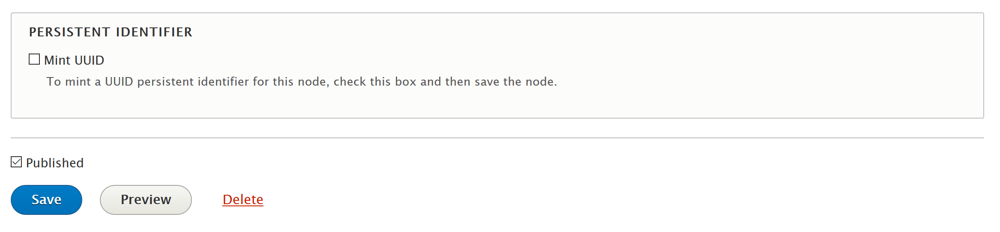

# Persistent Identifiers

## Introduction

Drupal 8 Module for minting and persisting persistent identifiers (Handles, DOIs, ARKs, etc.) for nodes.

This module's primary use case was to provide this service for [Islandora](https://islandora.ca/) objects, but it can be used without Islandora. Preliminary discussion that lead to this module can be found at https://github.com/Islandora/documentation/issues/1042 and https://github.com/Islandora/documentation/issues/1256.

Persistent identifiers can be minted by a variety of sources, such as CrossRef, DataCite, or EZID. Regardless of the specific source, many of the tasks involved in assigning persistent identifiers to Drupal nodes are the same - providing a "Mint Identifier" button in a node edit form, integration into automated workflows, or persisting identifiers to fields on an entity.

This module provides some common tasks while allowing small amounts of code (specifically Drupal services) to handle the particulars of minting and persisting. In addition, a Drupal site admin might want to mix and match minting and persisting services. Generally speaking, this module's goal is to allow site admins to select the minters and persisters they want, while helpin developers to write as little code as necessary to create new minter and persister services.

Currently, the following Minters are available:

* [Handle](modules/hdl) (contributed by [@elizoller](https://github.com/elizoller))
* [DataCite DOI Minter](modules/doi_datacite/README.md)

The following Persisters are available:

* Generic Text Field

## Requirements

Drupal 8. This module is not specific to Islandora.

For production use, you will need access to an API for minting persistent identifiers (e.g., [DataCite](https://datacite.org/), [EZID](https://ezid.cdlib.org/), etc.).

## Installation

1. Clone this repo into your Islandora's `drupal/web/modules/contrib` directory.
1. Enable the module either under the "Admin > Extend" menu or by running `drush en -y persistent_identifiers`.
1. Enable the Minter module that you want to use. The Generic Text Field persister is part of the this module and is enabled by default.

## Configuration

1. Visit `/admin/config/persistent_identifiers/settings` for options. Specific configuration options will vary depending on which Minter you select. See the README file for each Minter for more information.
1. Assign the "Mint persistent identifiers" permission to desired roles.

## Usage

This module works with a submodule (there are several) to "mint" and "persist" identifiers by showing the following at the bottom of the node add/edit form to users with the "Mint persistent identifiers" permission:

Minter submodules may provide additional workflow options such as using Views Bulk Operations to mint persistent IDs for a batch of nodes. The DataCite DOI module offers this option, for example.

## Current maintainer

* [Mark Jordan](https://github.com/mjordan)

## Contributing

Bug reports, improvements, feature requests, and PRs (especially for new minters and persisters) are welcome. Before you open a pull request, please open an issue.

### Writing minters

At a minimum, a minter module contains a services that "mints" (creates) the persistent identifier that mints the identifier. In its `.services.yml' file, the service must be registered using the ID pattern `foo.minter.sample`, where `foo` is the module's namespace and `sample` is unique to the minter. `minter` is a literal string. If the minter requires admin settings, the module should also include an implementation of `hook_form_alter()` that adds minter-specific settings to the admin form at `/admin/config/persistent_identifiers/settings`, and also adds minter-specific UI elements and validation to the node add/edit form.

The service class is implemented in the module's `src/Minter` directory, and implements `MinterInterface`. The persistent identifier is generated within and returned by the class's `mint()` method. See the source code in `modules/sample_minter` for more detail.

## License

[GPLv2](http://www.gnu.org/licenses/gpl-2.0.txt)
