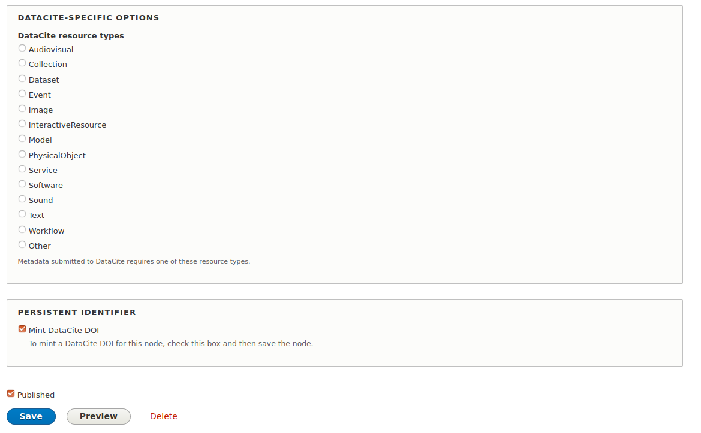

# DataCite DOI Minter

## Introduction

Drupal 8 Module that mints DOIs from DataCite via the Persistent Identifiers module.

## Requirements

* Drupal 8
* [Persistent Identifiers module](https://github.com/mjordan/persistent_identifiers)

You will also need an account at DataCite's [Fabrica](https://doi.datacite.org) service, and you probably should also have an account at the [Fabrica Test](https://doi.test.datacite.org) service as well. From these, you will need to assign a DOI prefix (similar to `10.802345`) for each repository that will be generating DOIs, and a separate prefix for testing.

## Installation

1. Clone this repo into your Islandora's `drupal/web/modules/contrib` directory.
1. Enable the module either under the "Admin > Extend" menu or by running `drush en -y doi_datacite`.

## Configuration

Visit `/admin/config/persistent_identifiers/settings` for options.

## Usage

Two ways:

1. Users with the "Mint persistent identifiers" permission will see an option at the bottom of the entity edit form will see a checkbox with the help text "Create DataCite DOI". Checking it will reveal a form with some DataCite-specific metadata fields they need to complete. Saving the node with this box checked will mint a DOI for the node and persist it to the field configured in the module's admin settings.
1. Via Views Bulk Operations.

The Views Bulk Operations method currently requires that all nodes in the batch have the same creator(s), publisher, publication year, and DataCite resource type.

## Specifying DataCite resource types

DataCite requires the use of a controlled vocabulary of resource types. This module adds this list to the node edit form, e.g.:



This list will appear along with other DataCite-specific form elements if the user checks the "Mint DataCite DOI" box. Note that the items selected from this list are not persisted to the node, which means that every time a user mints a new DOI for the node, they must reselect the resource type. This is not optimal, but since DOIs are generally only minted once, not storing this data is preferable to adding a field to the content type of store it in.

## Altering the metadata that gets submitted to DataCite

This module defines a hook that developers can use to alter the JSON that gets POSTed to DataCite as part of the DOI minting process.

```php
/*
 * Implements hook_doi_datacite_json_alter().
 */
function my_module_doi_datacite_json_alter($entity, $extra, &$datacite_json) {
  // Do something with the serialized $datacite_json, such as add additional
  // metadata elements as described at https://support.datacite.org/docs/api-create-dois.
}
```

## Current maintainer

* [Mark Jordan](https://github.com/mjordan)

## Contributing

Bug reports, improvements, feature requests, and PRs are welcome. Before you open a pull request, please open an issue.

## License

[GPLv2](http://www.gnu.org/licenses/gpl-2.0.txt)
