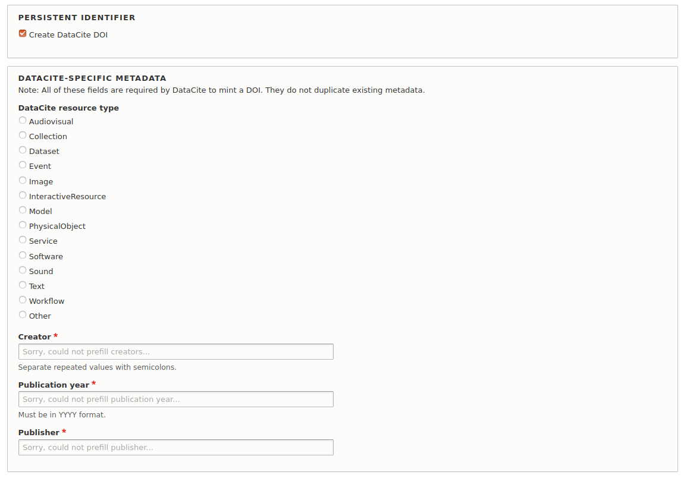
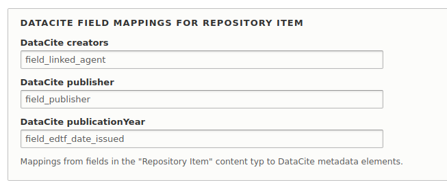

# DataCite DOI Minter

## Introduction

Drupal 8 Module that mints DOIs from DataCite via the Persistent Identifiers module.

## Requirements

* Drupal 8
* [Persistent Identifiers module](https://github.com/mjordan/persistent_identifiers)

You will also need an account at DataCite's [Fabrica](https://doi.datacite.org) service, and you probably should also have an account at the [Fabrica Test](https://doi.test.datacite.org) service as well. From these, you will need to assign a DOI prefix (similar to `10.802345`) for each repository that will be generating DOIs, and a separate prefix for testing.

## Installation

1. Clone this repo into your Islandora's `drupal/web/modules/contrib` directory.
1. Enable the module either under the "Admin > Extend" menu or by running `drush en -y doi_datacite`.

## Configuration

Visit `/admin/config/persistent_identifiers/settings` for options.

## Usage

Two ways:

1. Users with the "Mint persistent identifiers" permission will see an option at the bottom of the entity edit form will see a checkbox with the help text "Create DataCite DOI". Checking it will reveal a form with some DataCite-specific metadata fields they need to complete. Saving the node with this box checked will mint a DOI for the node and persist it to the field configured in the module's admin settings.
1. Via Views Bulk Operations.

The Views Bulk Operations method currently requires that all nodes in the batch have the same creator(s), publisher, publication year, and DataCite resource type, applied using a form during the batch operation.

## DataCite-specific metadata

Minting DOIs via DataCite requires that repositories register metadata that is used to provide discovery services at https://datacite.org/. The required elments are title, creator, publication year, publisher, and resource type. Resource type is taken from DataCite's own vocabulary.

To ensure that requests to mint DOIs have these required metadata elements, this module inject the following fields into the node add/edit form:



These DataCite-specific form widgets will appear if the user checks the "Create DataCite DOI" box. Note that these metadata elements are not persisted to the node, they are posted to the DataCite API to provide discovery services at https://datacite.org/. This module will attempt to derive values for these form fields from the node, using per-content-type mappings configured in the module's admin settings. Each node content type that has DOI minting enabled will have a set of options like this at `admin/config/persistent_identifiers/settings`:



If no values can be derived from these mappings, the form field in the node add/edit form remains empty as illustrated above, and the user will need to enter a suitable value.
 
## Altering the metadata that gets submitted to DataCite

Since the default DataCite metadata posted to https://datacite.org/ only contains DataCite's requiered elements (title, creators, publication year, publisher, and DataCite resource type), some repositories may want to submit fuller metadata. This module defines a hook that developers can use in third-party modules to alter the JSON that gets POSTed to DataCite as part of the DOI minting process.

```php
/*
 * Implements hook_doi_datacite_json_alter().
 *
 * @param object $entity
 *   The node.
 * @param mixed $extra
 *   The node edit form state or data from the Views Bulk Operations action.
 * @param string $datacite_json
 *   The DataCite JSON. See https://support.datacite.org/docs/api-create-dois
 *   for more information.
 */
function my_module_doi_datacite_json_alter($entity, $extra, &$datacite_json) {
  // Do something with the serialized $datacite_json, such as add additional
  // metadata elements as described at https://support.datacite.org/docs/api-create-dois.
}
```

## Current maintainer

* [Mark Jordan](https://github.com/mjordan)

## Contributing

Bug reports, improvements, feature requests, and PRs are welcome. Before you open a pull request, please open an issue.

## License

[GPLv2](http://www.gnu.org/licenses/gpl-2.0.txt)
